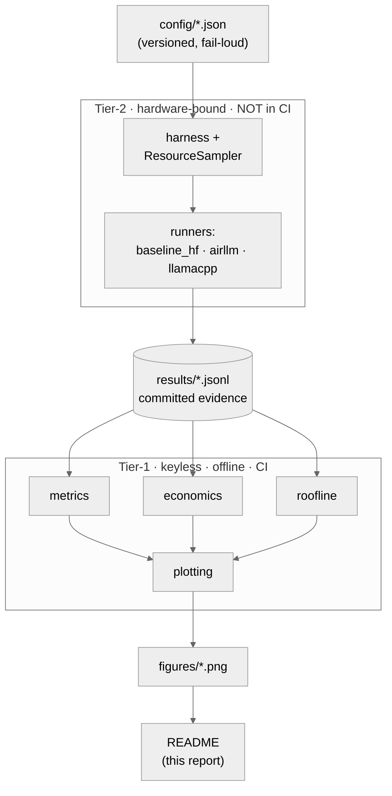
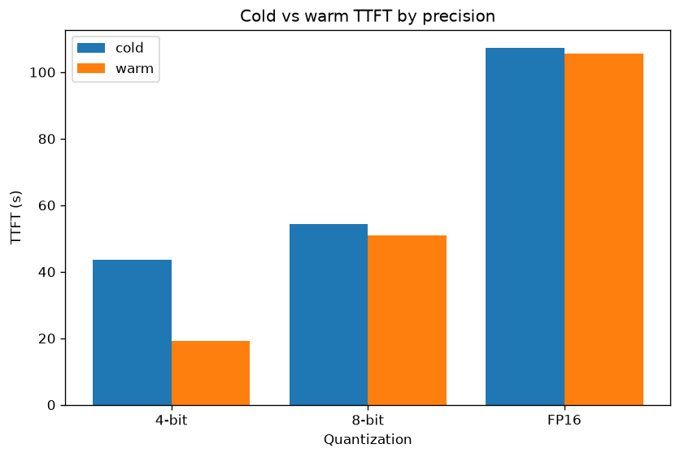
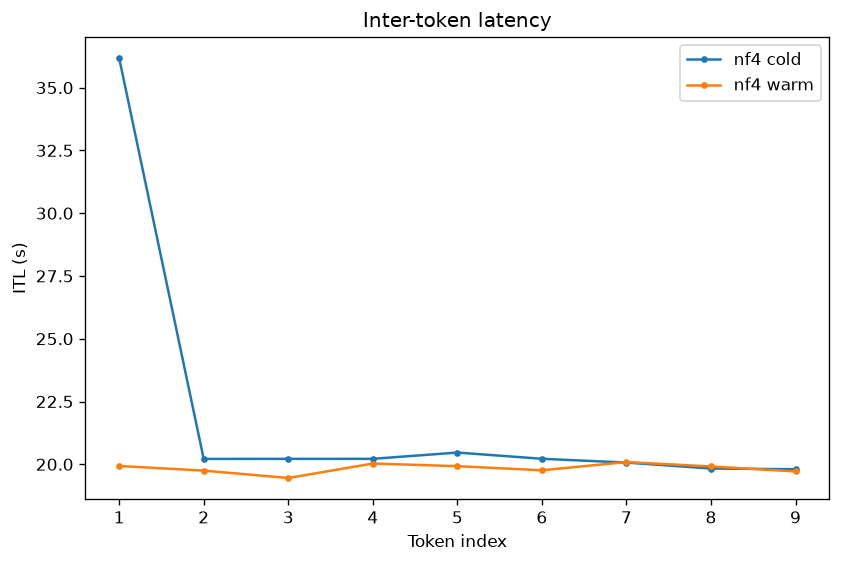
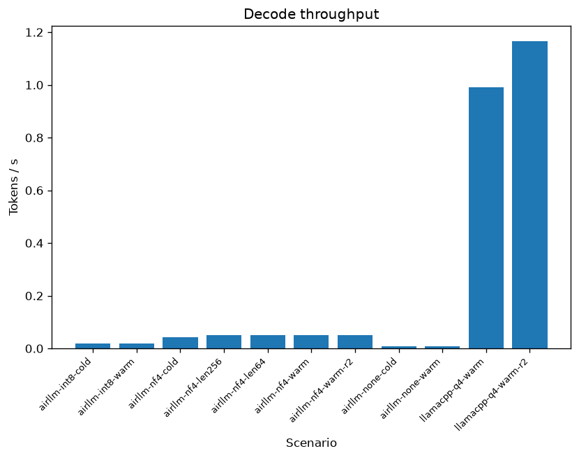
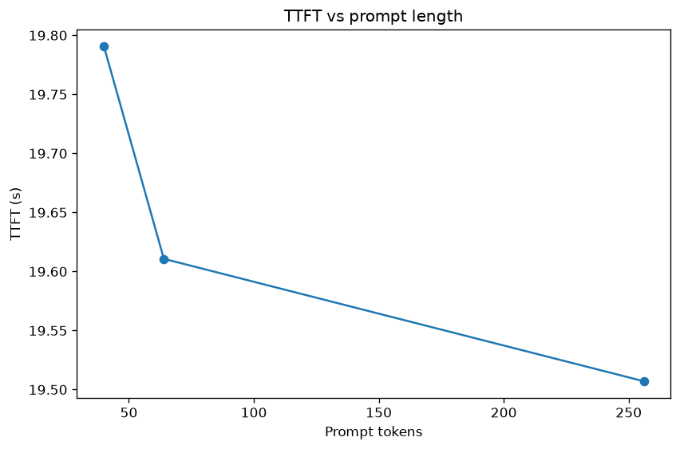
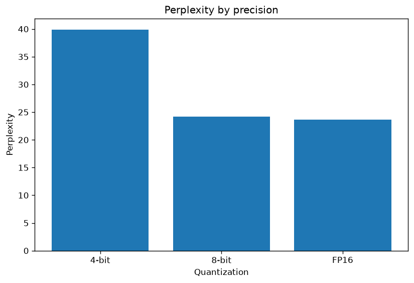
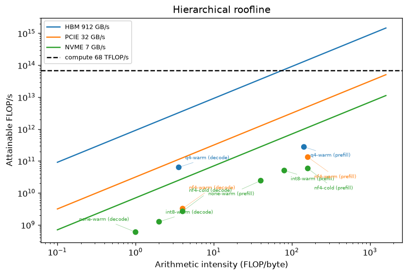
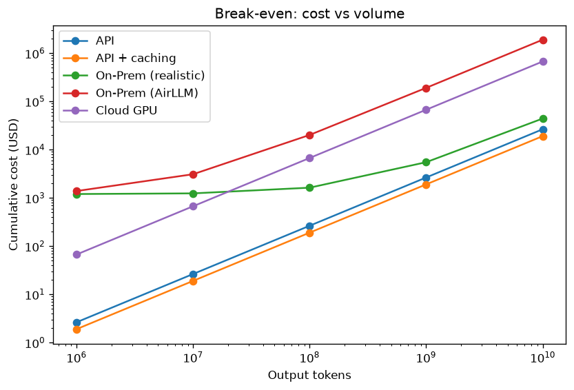

<div align="center">

# 🧠 airllm-bench

### When does layer-by-layer streaming actually pay off?

*Running a 32-billion-parameter LLM on a 12 GB consumer GPU via **AirLLM + quantization** — and a deep-dive into the latency, the economics, and the memory-hierarchy physics that decide the answer.*


</div>

---

> ### 📌 TL;DR — the headline result
> On a **RTX 3080 Ti (12 GB) / 32 GB / Ryzen 9 5900X** box, AirLLM makes a model that **can't fit** (Qwen2.5-32B, FP16 ≈ 64 GB — the direct baseline OOMs cleanly) **run anyway**. But the win from the OS page cache **collapses as the model outgrows RAM**:
>
> | Precision | Working set | Fits 27 GB cache? | Cold→warm TTFT | Speed-up |
> |-----------|------------:|:---:|----------------:|:---:|
> | **4-bit (NF4)** | 18 GB | ✅ yes | 43.7 s → **19.3 s** | **2.26×** |
> | **8-bit (INT8)** | 31 GB | ⚠️ at the edge | 54.3 s → 50.8 s | 1.07× |
> | **FP16** | 61 GB | ❌ no | 107.4 s → 105.5 s | 1.02× |
>
> And on cost: at Israel's $0.228/kWh, the **electricity alone** for single-stream local inference (~$4.30 / 1 M output tokens) already **exceeds the blended API price** (~$1.66 / 1 M) — so on-prem with this method **never breaks even**. A measured, theory-explained negative result (D12): **layer-streaming pays off for *capability* — "runs at all" — not for *throughput or cost* at 32 B.**

---

## ✅ Spec compliance — every deliverable, one click to its proof

The grader's checklist (brief §8 / [PRD §5](docs/PRD.md)) mapped straight to where it lives and how to verify it:

| # | Required deliverable | Where | Verify it |
|---|----------------------|-------|-----------|
| 1 | Full experiment code + reproducible run/measure scripts | [`src/`](src/airllm_bench), [Reproduction](#-reproduction) | [`docs/RUNBOOK_TIER2.md`](docs/RUNBOOK_TIER2.md) · `uv run airllm-bench bench` |
| 2 | Deep-dive technical report (this README) | the whole document | — |
| 3 | Comparative **tables + graphs** of performance, embedded inline | [Findings](#-findings) | 7 figures below · `make figures` |
| 4 | **Economic** analysis (API vs On-Prem + Cloud + caching) + break-even + assumptions | [Economics](#-economics--when-does-it-pay-for-itself) | [`config/economics.json`](config/economics.json) (sourced constants) |
| 5 | **Theory-linking** (Prefill/Decode, memory/compute-bound, VRAM, paging/mmap) | [Theory](#-theory-linking--why-the-numbers-look-like-that) | — |
| 6 | Original **extension** | [Hierarchical roofline](#-the-hierarchical-roofline--the-extension) | [`roofline/`](src/airllm_bench/roofline) |
| 7 | Reproduction instructions + **hardware spec** + **model-choice** justification | [Hardware](#-hardware--the-axis-everything-hangs-on), [Model](#-model-choice--qwen25-32b-instruct), [Reproduction](#-reproduction) | — |

> Two-tier reproducibility (D11): **Tier-1** (analysis → figures) is keyless, offline, and CI-tested — `make figures` regenerates every chart from committed JSON. **Tier-2** (the model runs) is hardware-bound, documented in the runbook, and committed as raw evidence under [`results/`](results/) — never claimed as CI-reproducible.

---

## 🎯 The question

The brief asks us to take a model **too large for the hardware**, prove direct inference fails, then use **AirLLM layer-streaming + quantization** to run it — and analyze the cost/benefit. AirLLM's trick: instead of holding all 64 layers in VRAM, it **streams one layer at a time** from disk → RAM → VRAM, computes, frees it, repeats. Peak VRAM stays tiny; the price is that **every token re-reads the whole model from storage**.

That reframes the entire problem as a **memory-hierarchy** question, and gives the report its thesis:

> **Layer-streaming converts a capacity wall into a bandwidth tax.** Whether that tax is bearable depends on *which tier of the memory hierarchy the model's working set lands in* — and quantization is the knob that moves it. This report measures exactly where, and what it costs.

A well-characterized negative result is explicitly welcomed by the brief, and is our honest finding: see [the narrative framing (D12)](docs/PRD.md#d12--negative-result-presented-as-characterization-not-failure).

---

## 🖥️ Hardware — the axis everything hangs on

| Component | Spec | Role in the experiment |
|-----------|------|------------------------|
| GPU | **RTX 3080 Ti, 12 GB VRAM** | The capacity wall the baseline must hit (OOM target). |
| RAM | **32 GB** | The model must exceed this so CPU-offload can't silently rescue the baseline — and so the page-cache effect has a hard ceiling. |
| CPU | Ryzen 9 5900X, 12 cores | CPU-fallback path; CPU power estimated by TDP. |
| Storage | **NVMe SSD** (C:) + slow HDD (D:) | AirLLM shards & the GGUF stream from the **NVMe**, never the HDD — the disk tier is the point. |
| OS | **Windows 10** (19045) | Native platform (no WSL2 — it would distort the disk-I/O numbers that *are* the result). |

Full spec is config, not prose: [`config/setup.json`](config/setup.json). Environment captured in every result row's `env` (Python 3.12 · torch 2.6.0+cu124 · CUDA 12.4 · driver 591.74).

---

## 🤖 Model choice — Qwen2.5-32B-Instruct

| Why this model | |
|---|---|
| **FP16 ≈ 64 GB** | 5× the VRAM, 2× the RAM — a *genuine* OOM that no offload can rescue (the assignment's premise). |
| **Strong, current, openly licensed** | A real model a practitioner would actually want to run locally. |
| **Not 72B** | The brief warns 70B+ has "no chance even with AirLLM"; 32B is the largest size where the *comparison* (does streaming help?) is meaningful rather than a foregone conclusion. |
| **Fallback policy** | Cut output tokens before cutting model size; 14B only as a documented last resort. Never triggered. |

The clean OOM is itself a measured result — see the baseline below. Justification locked in [PRD D2](docs/PRD.md#d2--model-qwen25-32b-instruct-fr-model).

---

## 🧪 Scenario matrix & experiment design

Five scenarios, one measurement harness, so every runtime is measured **identically** (D3):

| # | Scenario | Runtime | Quant | What it isolates |
|---|----------|---------|-------|------------------|
| 1 | **Baseline FP16 direct** → OOM | HF `transformers`, GPU-only | FP16 | The VRAM wall (yields no tokens). |
| 2 | **AirLLM FP16** | AirLLM | none | Worst case: 61 GB working set, disk-streaming bound. |
| 3 | **AirLLM INT8** | AirLLM (bitsandbytes) | int8 | 31 GB — right at the RAM edge. |
| 4 | **AirLLM NF4** | AirLLM (bitsandbytes) | nf4 | 18 GB — fits the page cache → the non-linear win. |
| 5 | **llama.cpp Q4_K_M + GPU offload** | llama.cpp | q4_k_m | **The realistic competitor** — weights resident in VRAM. |

Scenarios 2–4 are a **within-runtime quant sweep** (same algorithm, bit-width varies); scenario 5 is a **cross-runtime systems comparison** at "4-bit-class." They are *not* apples-to-apples (bitsandbytes NF4 ≠ GGUF K-quants), and the report labels them distinctly.

**How it's measured (D4/D5):** TTFT and per-token latency come from **per-token streaming timestamps**, never total ÷ count. Greedy decoding (temperature 0) for determinism. A background `ResourceSampler` thread samples NVML GPU power/VRAM + psutil RAM on one monotonic clock. **Cold vs warm** is measured with a **paired protocol**: an elevated cache flush isolates the model in the OS page cache, then the warm run repeats on the now-populated cache. GPU energy is integrated from measured NVML power; CPU energy is a declared TDP estimate.

**Prove the plumbing first (the G-SPIKE).** Before committing to the expensive 32B matrix (FP16 decode is ~1.8 min/token), a throwaway go/no-go spike validated the whole stack end-to-end on a *tiny* model — the streaming-timestamp instrumentation, NVML/psutil sampling, JSON output, and **one real Qwen2.5-32B token via AirLLM, timed**. A keyless **mock-runner smoke test** exercises the same harness wiring in CI on every PR. Only once the pipeline was proven did the real runs begin — the go/no-go outcome and the locked environment are recorded in [ADR 0001](docs/adr/0001-go-no-go-spike.md).



---

## 📊 Findings

> All numbers below are a pure function of the committed [`results/*.jsonl`](results/); every figure regenerates with `make figures`.

### 1. The baseline hits the wall — cleanly

Forcing GPU-only placement (`device_map={"":0}`, **never** `"auto"` — which would silently spill to the pagefile and thrash forever instead of failing), the FP16 baseline raises a clean **`CUDA out of memory`** at load. Peak VRAM **12.16 GB** — exactly the card's capacity. This is the wall AirLLM exists to get around, and it yields zero tokens by design.

### 2. The memory-hierarchy thesis — the cold→warm collapse

This is the centerpiece finding. The **only** thing that changes across the three bars is the quantization bit-width, which sets the working-set size:



The page-cache speed-up is **2.26× when the model fits (4-bit, 18 GB), 1.07× at the edge (8-bit, 31 GB), and 1.02× — gone — when it spills (FP16, 61 GB)**. When the working set fits the ~27 GB of usable cache, the second pass reads weights from RAM; when it doesn't, every pass re-reads from NVMe and "warm" buys nothing. **That collapse *is* the project's result.**

The per-token latency series shows the same story from inside a single run — the cold run pays a large first-token miss, then settles; the warm run is flat from the start:



### 3. Speed vs bits — you pay per byte streamed

Decode is dominated by how many bytes must be read per token. Time-per-output-token scales almost exactly with bit-width: **~20 s (4-bit) → ~52 s (8-bit) → ~108 s (FP16)** per token for AirLLM — versus **~0.46 s** for the resident llama.cpp competitor, **2+ orders of magnitude** faster because its weights never leave VRAM.



### 4. TTFT vs prompt length — prefill is streaming-bound, not compute-bound

Sweeping the prompt (40 / 64 / 256 tokens), AirLLM's time-to-first-token is **essentially flat** (~19.5–19.8 s):



Textbook prefill grows with input length (more tokens to process). Here it doesn't — because AirLLM is bottlenecked on **reading the model**, not on the matmuls over the prompt. The disk dominates so completely that prompt size barely registers. *(The sweep caps at 256 tokens — AirLLM's `max_seq_len=512` rejects 1024; see [L-08](docs/KNOWN_LIMITATIONS.md).)*

### 5. Quality vs bits — what the compression costs

Perplexity on a fixed held-out passage (one teacher-forced forward pass per quant, all at the **same** prompt length so the bars are comparable):



**8-bit is near-lossless vs FP16** (24.2 vs 23.7); **4-bit trades real quality for its speed** (39.9). Cross-runtime, llama.cpp's GGUF **Q4_K_M perplexity is ~25.1** — markedly better than bitsandbytes NF4 at a similar bit budget, a concrete reason the K-quant competitor wins on both axes. *(Perplexity is a deterministic proxy, not human eval — [L-05](docs/KNOWN_LIMITATIONS.md); the quant schemes aren't identical — D3.)*

---

## 📐 Theory-linking — why the numbers look like that

| Concept | What we measured | The link |
|---------|------------------|----------|
| **Prefill vs decode** | TTFT flat vs prompt length (§4); TPOT ~constant per token | Both phases are gated by **reading the model from disk**, not by compute — so the usual prefill-grows / decode-flat distinction is swamped by streaming. |
| **Memory-bound vs compute-bound** | AirLLM achieves **<10 % of every bandwidth ceiling** (roofline below) | AirLLM is **overhead-bound** (Python, per-layer orchestration) below even the disk roof; llama.cpp decode is **HBM-memory-bound** (the textbook LLM-decode regime). |
| **VRAM capacity wall** | Baseline OOM at 12.16 GB; AirLLM peak VRAM ~5–6 GB | Streaming one layer trades the capacity wall for a bandwidth tax — the core mechanism. |
| **Paging / mmap / page cache** | The cold→warm collapse (§2); RSS vs system-cached gap | A 4-bit working set (18 GB) **fits** the ~27 GB usable page cache, so warm reads hit RAM; 8-bit/FP16 **evict** and re-read from NVMe. The hierarchy, made measurable. |

---

## 🧮 The hierarchical roofline — *the extension*

The original extension (D7) and the report's unifying figure. We build the textbook GPU roofline (compute roof + HBM diagonal), then **extend it downward** with the **PCIe and NVMe bandwidth ceilings** the streaming paths actually live on, and place every measured operating point on the tier that binds it — with the arithmetic shown.



**Read it by colour** (each point is coloured by the ceiling it binds to):

- 🟢 **NVMe (green):** AirLLM **nf4-cold**, **int8** and **FP16** decode — the working set doesn't fit cache, so weights stream from disk (16 / 32 / 64 GB *per token*).
- 🟠 **PCIe (orange):** AirLLM **nf4-warm** — the 18 GB working set is cached, so reads come from RAM over PCIe instead of disk. **The same tool climbs a tier** purely because quantization pulled it under RAM. That upward shift is the memory hierarchy made visible.
- 🔵 **HBM (blue):** **llama.cpp q4-warm** decode — weights resident in VRAM, the only path near the silicon roof (~63 GFLOP/s achieved), and the only one in the classic memory-bound-decode regime.

Every AirLLM point sits **far below even its own disk/PCIe ceiling** (<10 % utilization) — the honest reading is that AirLLM is **per-layer-overhead-bound**, not bandwidth-saturated ([L-10](docs/KNOWN_LIMITATIONS.md)). Ceilings and bytes-per-weight are config ([`setup.json → roofline`](config/setup.json)), each with a cited source.

---

## 💰 Economics — when does it pay for itself?

Five cost lines, all knobs in [`config/economics.json`](config/economics.json) with **source + retrieval date** on every constant (no live pricing — D8). Local electricity is driven by **measured** energy.



| Line | Marginal $/1M output tok | Breaks even vs API? |
|------|-------------------------:|:---:|
| **API** (OpenRouter Qwen2.5-Coder-32B) | $1.66 | — |
| **API + caching** | $1.36 | — |
| **On-Prem, realistic** (llama.cpp, +$1200 CAPEX) | **$4.30** | ❌ never |
| **On-Prem, AirLLM** (cautionary) | $189.92 | ❌ never |
| **Cloud GPU** (RunPod RTX 3090) | $67.25 | ❌ never |

**The decisive number:** the realistic on-prem **marginal electricity cost ($4.30/Mtok) already exceeds the API's *total* price ($1.66/Mtok)** — before a cent of the $1,200 CAPEX. At a single-stream duty cycle, owning the hardware never amortizes; the API's batching/throughput advantage wins outright. AirLLM's line is ~115× the API and exists purely to **show with numbers that it never amortizes** (D6).

> **Caveat (D6/[L-09](docs/KNOWN_LIMITATIONS.md)):** 4-bit local quality ≠ a frontier API, and the API/cloud lines anchor on the closest *documented* comparable SKUs (Coder-32B price; RTX 3090 cloud), not identical ones. The recommendation holds with wide margin regardless.

**Recommendation:** for **single-stream 32B on this class of hardware**, use the API. Choose local only when *capability* (runs at all, offline, data never leaves the box) outranks throughput and cost — which is exactly the niche AirLLM fills.

---

## 🔁 Reproduction

### Tier-1 — analysis & figures (keyless, offline, ~seconds)

```bash
make install      # core + dev deps only — no GPU, no key, no network
make figures      # regenerate all 7 figures from committed results/*.jsonl
make grade        # full gate: ruff + mypy --strict + 180 tests @ 99% + scanners
```

Everything in [Findings](#-findings) and [Economics](#-economics--when-does-it-pay-for-itself) rebuilds from the committed [`results/`](results/) JSON with no hardware. This is what CI runs on every PR.

### Tier-2 — the measured model runs (hardware-bound)

The raw `results/*.jsonl` are committed as **evidence**, produced once on the documented box. The exact procedure — disk choreography, elevated cold-cache flush, per-compression sharding — is in **[`docs/RUNBOOK_TIER2.md`](docs/RUNBOOK_TIER2.md)**:

```bash
uv sync --extra runtime --extra llamacpp     # the heavy stack, GPU box only
uv run airllm-bench bench --experiments config/experiments/airllm-nf4-cold.json ...
```

This is **never** run in CI (D11) — a single FP16 token takes ~1.8 minutes; the full matrix is ~3 hours.

---

## 🏗️ Engineering & reproducibility

Beyond the science, the project is built to the course's professional-software bar. Each claim links to its proof.

#### Configuration & security
| | |
|---|---|
| **Zero hardcoded values** | every model id, price, tariff, ceiling lives in `config/*.json` — enforced by [`check_no_hardcoded.py`](scripts/check_no_hardcoded.py). |
| **Versioned, fail-loud config** | each file carries a `"version"`; the loader raises `ConfigVersionError` on mismatch ([`shared/config.py`](src/airllm_bench/shared/config.py)). |
| **Keyless by default** | the whole Tier-1 suite + figures run with no key; `.env` holds only `HF_TOKEN`, `.env.example` is committed, secrets are redacted in the logger. |
| **Sourced constants** | every price/tariff in [`economics.json`](config/economics.json) carries a `source` + `retrieved` date; Gatekeeper recorded **N/A** ([ADR 0002](docs/adr/0002-gatekeeper-na.md)). |

#### Modularity
Measurement → analysis → presentation are cleanly separated; raw JSON is the single source of truth and everything downstream is a pure function of it. The one real abstraction is the **`Runner` Protocol** (`load`/`stream`/`logits`/`unload`) — three real implementations + a mock — so every runtime is measured identically. **Every source file is ≤ 150 lines** (CI-enforced, [`check_file_sizes.py`](scripts/check_file_sizes.py)). Adding a model, quant, or scenario is config-only — see [`docs/EXTENDING.md`](docs/EXTENDING.md).

#### Testing & quality gates — two layers
| Layer | Proves | Where |
|-------|--------|-------|
| **Unit tests** | the code *runs* | **180 tests, 99% coverage** (≥90 bar), `mypy --strict` 0 errors, `ruff` 0 |
| **Structural evals** | the analysis *behaves* | [`tests/evals/structural/`](tests/evals/structural) — harness captures every field, break-even is monotonic, roofline points are correct from inputs |
| **Data ↔ figure binding** | no figure without evidence | [`check_raw_data.py`](scripts/check_raw_data.py) — every committed figure traces to backing rows |
| **Report contract** | the report is complete | [`check_report.py`](scripts/check_report.py) — every mandated section + figure is present |

```text
$ make grade
ruff ............... All checks passed!
ruff format ........ 106 files already formatted
mypy --strict ...... Success: no issues found in 50 source files
pytest ............. 180 passed — coverage 99% (fail-under 90)
check_file_sizes ... ok   check_anti_patterns ... ok
check_no_hardcoded . ok   check_raw_data ........ ok
All quality checks passed.
```

#### Process
Atomic PRs · squash-merge · **cross-model PR review** (a separate model family reviews every PR before merge — see [`docs/REVIEW_PROCESS.md`](docs/REVIEW_PROCESS.md)) · Conventional Commits · honest-disclosure triad ([`KNOWN_LIMITATIONS.md`](docs/KNOWN_LIMITATIONS.md) · [`SELF_GRADE.md`](docs/SELF_GRADE.md) · [`COST.md`](docs/COST.md)) · a runnable self-grade (`uv run python scripts/self_grade.py`).

---

## ⚠️ Known limitations & honest self-grade

Disclosed up front, because a documented limitation is cheap and a hidden one a grader finds is fatal. Ten are catalogued with severity + fix sketch in **[`docs/KNOWN_LIMITATIONS.md`](docs/KNOWN_LIMITATIONS.md)** — the headline ones:

- **L-01 — Single-machine measurement.** Tier-2 numbers are *this* box; CI can't reproduce them (inherent — the analysis pipeline *is* CI-reproducible).
- **L-07 — Cold flush isn't magnitude-verified on Windows.** The Standby List counts toward `available`, so cold-ness is evidenced by the **cold/warm timing delta**, not a freed-MB number.
- **L-08 — Prompt sweep caps at 256 tokens** (AirLLM `max_seq_len=512`).
- **L-09 — Economics anchors on near-comparable SKUs**, not identical ones.
- **L-10 — Roofline tier is assigned by data path, not measured saturation** (AirLLM is overhead-bound below every ceiling).

The self-assessed grade is computed from a data-driven rubric and is re-runnable: `uv run python scripts/self_grade.py`. See [`docs/SELF_GRADE.md`](docs/SELF_GRADE.md).

---

## 🗂️ Repository map

```
airllm-bench/
├── src/airllm_bench/
│   ├── shared/      # versioned fail-loud config + JSONL logger
│   ├── harness/     # the ONE measurement harness + ResourceSampler thread   ── Tier-2
│   ├── runners/     # Runner Protocol + baseline_hf / airllm / llamacpp / mock ─┘
│   ├── metrics/     # TTFT/TPOT/throughput/perplexity from raw RunResult  ─┐
│   ├── economics/   # API / on-prem / cloud cost + break-even             │
│   ├── roofline/    # compute/HBM/PCIe/NVMe ceilings + operating points   ├─ Tier-1 (keyless)
│   ├── plotting/    # all 7 figures, generated FROM results/              │
│   └── report/, grading/   # README contract + self-grade scorer         ─┘
├── config/          # setup.json · economics.json · experiments/ · self_grade.json
├── results/         # committed Tier-2 raw JSON (the source of truth)
├── figures/         # the 7 committed figures (regenerate: make figures)
├── scripts/         # CI scanners: file-size, anti-pattern, no-hardcoded, raw-data, report
└── docs/            # PRD · PLAN · TODO · ADRs · RUNBOOK · KNOWN_LIMITATIONS · SELF_GRADE · COST
```

---

## 👥 Authors & license

Built for **Orchestration of AI Agents** (203.3763), University of Haifa · Dr. Yoram Segal.

| Name | Role |
|------|------|
| **Imree Cohen** ([@Imreec](https://github.com/Imreec)) | Driver — harness, runners, analysis, report; authors most commits |
| **Eyal Shtinmetz** ([@eyalsht](https://github.com/eyalsht)) | Reviewer — cross-model PR review, design pushback, docs |

Ownership is honest and consistent with `git shortlog` ([AUTHORS.md](AUTHORS.md), [D13](docs/PRD.md#d13--honest-ownership--calibrated-self-grade)). Licensed **MIT** — see [LICENSE](LICENSE).

Planning docs: [PRD](docs/PRD.md) · [PLAN](docs/PLAN.md) · [TODO](docs/TODO.md) · the 13 locked decisions D1–D13.
